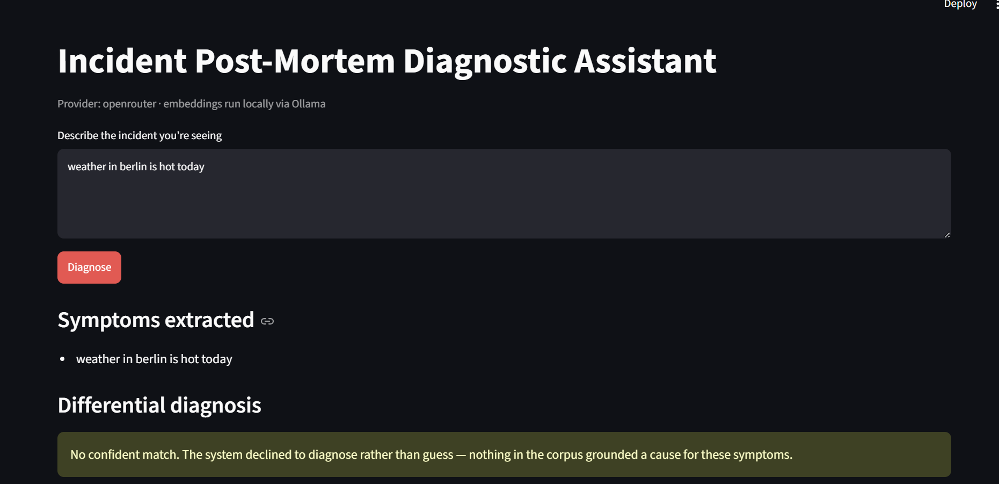

# Incident Post-Mortem Retrieval Assistant

**When a system goes down, an engineer can describe the failure in plain English and get back the most relevant past incidents — their root causes, how they were fixed, and how confident the system is that they match.**

Post-mortems hold the answers to "has this happened before?" — but they're buried in wikis and folders, unsearchable in the moment you need them. This project makes that institutional memory queryable, and — more importantly — **measures whether the answers can be trusted.**

Because retrieving the *wrong* past incident during a live outage sends an engineer chasing the wrong root cause, the evaluation framework is the core of this project, not an afterthought. Every retrieval and generation decision is measured against a documented ground-truth suite, tuned on evidence, and gated in CI so quality can't silently regress.

That last part is the point: **this is a system built to keep working, not just to work once.**

---

## Demo

*Two queries, opposite behavior, the same interface. This contrast is the whole thesis.*

**A real incident → a grounded diagnosis.** The system decomposes the description into symptoms, retrieves past incidents for each, separates root cause from downstream effect, and ranks the causes with confidence — every citation traceable to a real retrieved incident.


**Off-corpus junk → an honest refusal.** Given something it has no evidence for, the system declines rather than inventing a plausible-sounding answer. No fabricated incident, no wasted model call.




**🎥 Walkthrough video**

<!-- Replace this block with the embedded video / thumbnail link once recorded.
     A common pattern: a clickable thumbnail linking to the video —
     [](VIDEO_URL) -->

_Coming soon._

---

## How it works

The system is three layers. Each answers a different question.

### Layer 1 — Retrieval pipeline *(does it find the right incident?)*

The classic RAG path: ingest post-mortems, split them into section-aware chunks, turn each into an embedding (a vector capturing its meaning), store them in ChromaDB, and retrieve the closest matches to a query. Generation is grounded — the model answers *only* from retrieved sources, with numbered citations, and declines when nothing is close enough. The decline is layered: a distance threshold at the retrieval step **and** a grounded prompt at the generation step, because neither alone is enough.

### Layer 2 — Diagnostic agent *(what's actually the root cause?)*

A single retrieval can't tell cause from effect. This layer is a **LangGraph agent** with four nodes sharing visible state:

- **Decompose** — break the incident description into distinct symptoms
- **Retrieve** — pull past incidents for each symptom (calls Layer 1 as a tool)
- **Assess** — cross-reference the evidence and judge whether it's sufficient
- **Diagnose** — produce a ranked differential diagnosis with confidence

Retrieval is dynamic, not fixed: the agent loops when a symptom has no evidence and stops when every symptom is covered *or* a hard iteration cap (3) is reached. A grounding filter strips any citation the model invented — a candidate cause survives only if it traces to an incident actually retrieved.

### Layer 3 — Regression gate *(is it still as good as it was?)*

This is the layer most portfolio RAG projects don't have. On every push, CI re-indexes if the corpus changed, re-runs the full metric suite, and diffs the results against a committed baseline. A quality drop **fails the build.** The gate policy is deliberate — *gate by consequence, not by number:*

- **Hard invariants** (block on any drop): grounding violations, hit rate, filter precision/recall, Layer 2 decline behavior
- **Soft threshold**: MRR, floored just below baseline to absorb known run-to-run noise
- **Report-only**: small discrete metrics where noise and signal are the same size — checked per-entry, not against an aggregate floor

That's the tagline in code: a merge is blocked the moment retrieval quality regresses.

---

## Evaluation

A **39-query ground-truth suite** (`data/eval/query_suite.json`) across retrieval, decline, and filter modes. A hit is document-level primary, section-level secondary.

**Retrieval quality** (Layer 1, distance threshold `0.30`):

| Metric | Value | What it means |
|--------|-------|---------------|
| Hit rate | **1.00** | the correct incident is retrieved every time |
| MRR | **0.92** | and it's almost always ranked first |
| Section accuracy | 0.50 | right document, right section about half the time |
| Filter precision / recall / exact-match | **1.00** | metadata filters ("minor severity", "config errors at Cloudflare") return exactly the right set |

**Retrieval holds up as queries get harder** — the correct incident is never lost, it just ranks lower against distractors:

| Difficulty | Count | Hit rate | MRR |
|------------|-------|----------|-----|
| Easy (direct) | 6 | 1.00 | 1.00 |
| Medium (symptom-phrased) | 15 | 1.00 | 0.96 |
| Hard (distractors, discrimination) | 11 | 1.00 | 0.82 |

**Why the 0.30 threshold?** It was chosen from a sweep, not guessed. 0.30 is the lowest threshold where every real query still retrieves its incident, while keeping the strongest rejection of off-corpus junk:

| Threshold | Hit rate | Decline rate | |
|-----------|----------|--------------|---|
| 0.20 | 0.26 | 1.00 | too strict — refuses almost everything |
| 0.25 | 0.65 | 0.80 | still missing real incidents |
| **0.30** | **1.00** | **0.60** | **chosen — full retrieval, strongest junk-rejection** |
| 0.35 | 1.00 | 0.20 | starts accepting queries it should refuse |
| 0.50 | 1.00 | 0.00 | never declines anything |

*(Sweep ran on the earlier 23-query suite, where MRR reads 0.949 at the chosen threshold; the 0.92 above is the same behavior measured on the current, larger 39-query suite.)*

**Diagnostic agent** (Layer 2, threshold `0.36`, 15-entry suite): grounding violations **0**, top-1 accuracy **0.667** (on scoreable single-cause entries), correct decline on both true no-match probes. The fabricated-citation filter holds across every entry — no invented incident survives into a diagnosis.

---

## Known limitations

Named on purpose. Knowing where a reliability system fails is part of the work.

- **It matches on vocabulary, not mechanism.** Two Layer 1 decline probes leaked because they share *words* with real incidents: a DDoS query pulled Cloudflare outages (shared CDN/edge vocabulary), and an SSL-certificate-expiry query pulled a GitHub auth incident. The same pattern shows in Layer 2's noise rate of 0.47 — nearly half its candidate causes are off-target, occasionally at high confidence (a Cloudflare WAF incident once ranked as Roblox). Documented as a known failure pattern, not silently patched.
- **The agent over-declines on terse cause-effect symptoms.** When a symptom is phrased only as an effect ("nothing can authenticate", "crashed / blue-screened"), Layer 2 sometimes retrieves nothing and declines even though a matching incident exists. It needs symptom text with enough substance to embed against.
- **Section accuracy is 0.50.** The system reliably finds the right *document* but lands on the most relevant *section* only about half the time — fine for surfacing an incident, weaker for pinpointing the exact passage.
- **Deferred filter-recall bug.** Metadata-filter queries currently cap results at `top_k`, which is harmless at 20 documents (no filter matches more) but will under-recall as the corpus grows. Tracked in the ADRs, deliberately deferred.

---

## Corpus

**First-party post-mortems only** — no reconstructed or fictional incidents. Every document traces to its primary source, is verified against it, and is enforced to a 5-section schema (Summary, Timeline, Root Cause, Resolution, Prevention). The ledger (`data/incidents.csv`) is generated from the files themselves, never hand-maintained.

**Current corpus: 20 incidents → 107 chunks**, drawn from public post-mortems by Cloudflare, GitHub, GitLab, AWS, Roblox, Sentry, CrowdStrike, CircleCI, Codecov, and TanStack.

---

## Stack

- **Language:** Python 3.12
- **Agent framework:** LangGraph — chosen over LangChain agents and LlamaIndex for **inspectability**. Every node writes to visible state, which is exactly what makes the Layer 3 stage-by-stage evaluation possible.
- **Models:** `qwen3:8b` (generation) and `nomic-embed-text` (embeddings), run locally via **Ollama** (CPU-only). Generation can be routed through **OpenRouter** — the same `qwen3-8b` weights, hosted — via an `LLM_PROVIDER` switch, giving far faster inference for evaluation runs and the live demo.
- **Vector store:** ChromaDB (cosine distance)
- **Interface:** Streamlit (local demo UI)
- **CI/CD:** GitHub Actions with metric-threshold regression gating
- **Dev environment:** WSL2 / Ubuntu 24.04

---

## Run it locally

```bash
# 1. Pull the models
ollama pull nomic-embed-text && ollama pull qwen3:8b

# 2. Install dependencies
pip install -r requirements.txt

# 3. Configure the provider (fast generation via OpenRouter; embeddings stay local)
#    In .env:
#      LLM_PROVIDER=openrouter
#      OPENROUTER_API_KEY=...        # never commit this

# 4. Build the index
python src/ingestion.py

# 5. Launch the demo (Ollama must be running for embeddings)
streamlit run app.py
```

Open `http://localhost:8501`, describe an incident, and click **Diagnose**.

To run the evaluation suite and the fast test suite locally:

```bash
python -m src.eval.runner                    # produce current metrics
pytest -m "not slow and not integration"     # fast test suite
```

---

## Design decisions

Every significant architectural decision is recorded as an ADR — the reasoning, the alternatives considered, and the bugs found along the way (stale ChromaDB masquerading as a regression, non-reproducible baselines, partially-fabricated citations slipping past a naive grounding check). The threshold-sweep evidence trail and the gate-by-consequence policy are documented there.

## License

MIT