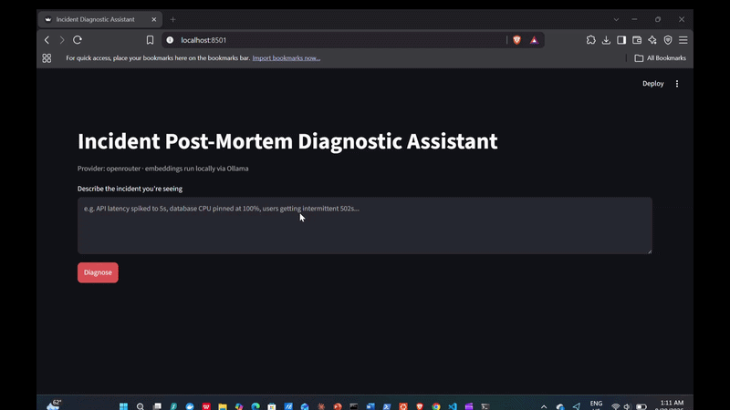
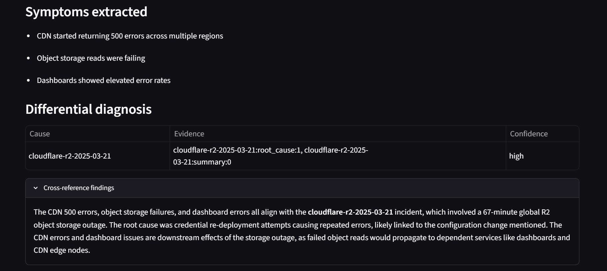
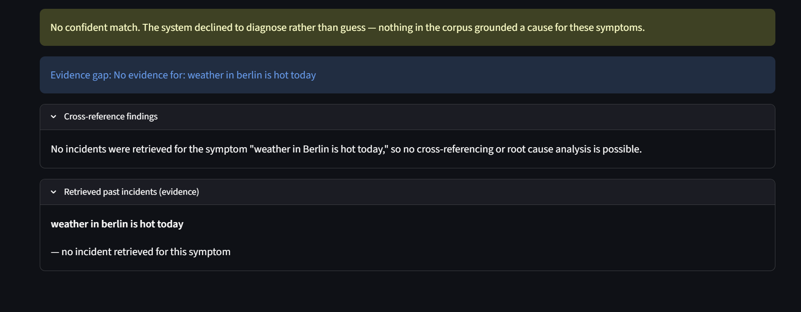

# Incident Post-Mortem Retrieval Assistant

**When a system crashes at 3 a.m., it answers: "have we seen this before?"**

Every outage gets written up — then buried in a wiki nobody can search during the next one. Describe a failure in plain English and this system returns the most relevant past incidents, their root causes, how they were fixed, and how confident it is that they match. When it has no real evidence, it **refuses to answer** instead of inventing a convincing wrong one.

Because retrieving the wrong incident during a live outage sends an engineer chasing the wrong root cause, **the evaluation framework is the core of this project, not an afterthought** — every retrieval and generation decision is measured against a ground-truth suite and gated in CI so quality can't silently regress. A system built to keep working, not just to work once.

[](https://github.com/kai2055/incident-postmortem-assistant/actions/workflows/ci.yml)




## The demo: two queries, opposite behavior, same interface

This contrast **is** the thesis.

**A real incident → a grounded diagnosis.** The system decomposes the description into symptoms, retrieves past incidents for each, separates root cause from downstream effect, and ranks causes with confidence — every citation traceable to a real retrieved incident.



**Off-corpus junk → an honest refusal.** Given something it has no evidence for, it declines rather than inventing a plausible-sounding answer. No fabricated incident, no wasted model call.



---

## What it does well

- 🎯 Retrieves the correct past incident **every time** — hit rate **1.00**, MRR **0.92** (almost always ranked first)
- 🚦 A CI gate **blocks any merge the moment retrieval quality drops** — gated by consequence, not by a single number
- 🛑 **Zero grounding violations** — no invented incident survives into a diagnosis
- 📖 Its own failure modes are **named, not hidden** (see [Known limitations](#known-limitations))

---

## How it works — three layers, three questions

### Layer 1 — Retrieval (does it find the right incident?)
The classic RAG path: ingest post-mortems, split into **section-aware chunks**, embed each, store in **ChromaDB**, retrieve the closest matches. Generation is grounded — the model answers only from retrieved sources, with numbered citations, and declines when nothing is close enough. The decline is **layered**: a distance threshold at retrieval *and* a grounded prompt at generation, because neither alone is enough.

### Layer 2 — Diagnostic agent (what's actually the root cause?)
A single retrieval can't tell cause from effect. This is a **LangGraph** agent — four nodes sharing visible state:

**Decompose** (split into distinct symptoms) → **Retrieve** (pull incidents per symptom, calling Layer 1 as a tool) → **Assess** (judge whether evidence is sufficient) → **Diagnose** (ranked differential diagnosis with confidence).

Retrieval is **dynamic**: the agent loops when a symptom has no evidence and stops when every symptom is covered or a hard cap (3 iterations) is hit. A **grounding filter** strips any citation the model invented — a candidate cause survives only if it traces to an incident actually retrieved.

### Layer 3 — Regression gate (is it still as good as it was?)
The layer most portfolio RAG projects don't have. On every push, CI re-indexes if the corpus changed, re-runs the full metric suite, and diffs against a committed baseline. **A quality drop fails the build.** The policy gates *by consequence*:

| Tier | Metrics | Rule |
| --- | --- | --- |
| **Hard invariants** | grounding violations, hit rate, filter precision/recall, Layer 2 decline behavior | block on *any* drop |
| **Soft threshold** | MRR | floored just below baseline to absorb run-to-run noise |
| **Report-only** | small discrete metrics where noise ≈ signal | checked per-entry, not against an aggregate floor |

---

## Evaluation

A **39-query ground-truth suite** (`data/eval/query_suite.json`) across retrieval, decline, and filter modes. A hit is document-level primary, section-level secondary.

**Retrieval quality (Layer 1, distance threshold 0.30):**

| Metric | Value | What it means |
| --- | --- | --- |
| Hit rate | **1.00** | the correct incident is retrieved every time |
| MRR | **0.92** | and it's almost always ranked first |
| Section accuracy | 0.50 | right document, right *section* about half the time |
| Filter precision / recall / exact-match | **1.00** | metadata filters return exactly the right set |

**It holds up as queries get harder** — the correct incident is never lost, it just ranks lower against distractors:

| Difficulty | Count | Hit rate | MRR |
| --- | --- | --- | --- |
| Easy (direct) | 6 | 1.00 | 1.00 |
| Medium (symptom-phrased) | 15 | 1.00 | 0.96 |
| Hard (distractors, discrimination) | 11 | 1.00 | 0.82 |

**Why 0.30?** Chosen from a sweep, not guessed — the lowest threshold where every real query still retrieves its incident, while keeping the strongest rejection of off-corpus junk:

| Threshold | Hit rate | Decline rate | |
| --- | --- | --- | --- |
| 0.20 | 0.26 | 1.00 | too strict — refuses almost everything |
| 0.25 | 0.65 | 0.80 | still missing real incidents |
| **0.30** | **1.00** | **0.60** | **chosen — full retrieval, strongest junk-rejection** |
| 0.35 | 1.00 | 0.20 | starts accepting queries it should refuse |
| 0.50 | 1.00 | 0.00 | never declines anything |

*(Sweep ran on the earlier 23-query suite, where MRR reads 0.949 at the chosen threshold; the 0.92 above is the same behavior on the current 39-query suite.)*

**Diagnostic agent (Layer 2, threshold 0.36, 15-entry suite):** grounding violations **0**, top-1 accuracy **0.667** (on scoreable single-cause entries), correct decline on both true no-match probes. The fabricated-citation filter holds across every entry.

---

## Known limitations

Named on purpose — knowing where a reliability system fails is part of the work.

- **It matches on vocabulary, not mechanism.** Two decline probes leaked on shared words: a DDoS query pulled Cloudflare outages (shared CDN/edge vocabulary), an SSL-expiry query pulled a GitHub auth incident. Layer 2's noise rate of 0.47 shows the same pattern — nearly half its candidate causes are off-target, occasionally at high confidence. Documented, not silently patched.
- **The agent over-declines on terse cause-effect symptoms.** A symptom phrased only as an effect ("nothing can authenticate", "crashed / blue-screened") sometimes retrieves nothing and declines even when a match exists — it needs enough substance to embed against.
- **Section accuracy is 0.50.** Reliably finds the right document, lands on the right *section* about half the time — fine for surfacing an incident, weaker for pinpointing the exact passage.
- **Deferred filter-recall bug.** Metadata-filter queries cap at `top_k` — harmless at 20 documents, but will under-recall as the corpus grows. Tracked in the ADRs, deliberately deferred.

---

## Corpus

First-party post-mortems only — no reconstructed or fictional incidents. Every document traces to its primary source, is verified against it, and is enforced to a 5-section schema (Summary, Timeline, Root Cause, Resolution, Prevention). The ledger (`data/incidents.csv`) is generated from the files themselves, never hand-maintained.

**Current corpus: 20 incidents → 107 chunks**, drawn from public post-mortems by Cloudflare, GitHub, GitLab, AWS, Roblox, Sentry, CrowdStrike, CircleCI, Codecov, and TanStack.

---

## Stack

- **Language:** Python 3.12
- **Agent framework:** LangGraph — chosen over LangChain agents and LlamaIndex for **inspectability**. Every node writes to visible state, which is exactly what makes the Layer 3 stage-by-stage evaluation possible.
- **Models:** `qwen3:8b` (generation) and `nomic-embed-text` (embeddings), run locally via **Ollama** (CPU-only). Generation can be routed through OpenRouter — the same weights, hosted — via an `LLM_PROVIDER` switch for far faster eval runs and the live demo.
- **Vector store:** ChromaDB (cosine distance)
- **Interface:** Streamlit (local demo UI)
- **CI/CD:** GitHub Actions with metric-threshold regression gating
- **Dev environment:** WSL2 / Ubuntu 24.04

---

## Run it locally

```bash
# 1. Pull the models
ollama pull nomic-embed-text && ollama pull qwen3:8b

# 2. Install dependencies
pip install -r requirements.txt

# 3. Configure the provider (fast generation via OpenRouter; embeddings stay local)
#    In .env:
#      LLM_PROVIDER=openrouter
#      OPENROUTER_API_KEY=...        # never commit this

# 4. Build the index
python src/ingestion.py

# 5. Launch the demo (Ollama must be running for embeddings)
streamlit run app.py            # http://localhost:8501 — describe an incident, click Diagnose
```

Evaluation and fast test suites:

```bash
python -m src.eval.runner                    # produce current metrics
pytest -m "not slow and not integration"     # fast test suite
```

---

## Design decisions

Every significant architectural decision is an ADR — the reasoning, the alternatives, and the bugs found along the way (stale ChromaDB masquerading as a regression, non-reproducible baselines, partially-fabricated citations slipping past a naive grounding check). The threshold-sweep evidence trail and the gate-by-consequence policy are documented there.

## License

MIT
